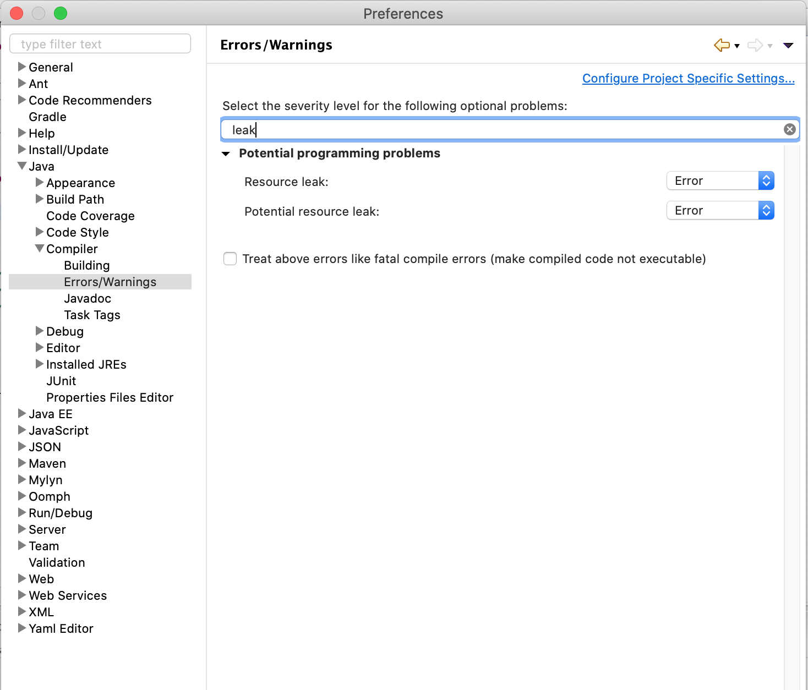

Garbage collection is the process by which the Java Virtual Machine determines which objects are no longer in use in an application, and proceeds to remove them from memory so that it can be recycled for other uses. Based on that, you might think that it’s impossible to have memory leaks in Java, yet here we are. 

A memory leak happens when an application is no longer using certain objects, but they’re still being referenced. Because of this, they are not eligible to be removed by the garbage collector. As time goes on, and the application continues running, more and more objects like this get created until the available memory fills up. This could eventually lead to an OutOfMemoryError, which is impossible to recover from.

Memory leaks are some of the trickiest issues in Java Applications. They can be easy to miss and hard to detect. 

### How to know if your application has a memory leak

If:

- Your application works fast when it has just started running, but slows down over time
- Your application does okay with small datasets, but struggles with large datasets 
- You get OutOfMemory heap errors 
- Your application has random/weird crashes

… there’s probably a memory leak somewhere.

As I said, it can be difficult to detect memory leaks, so it’s best to avoid them. I’m going to tell you about some common memory leak scenarios and good practices to prevent them. 

### 1. Heavy usage of static fields

This is a classic memory leak scenario where Java objects are being created without being released. Static references persist throughout the lifecycle of the JVM, and therefore the object cannot be cleared from memory.

For example:

    public class StaticFieldMemoryLeak {
        private static List<Integer> integers = new ArrayList<Integer>();

        public void insertIntegers() {
            for (int i = 0; i < 100000000; i++) {
                integers.add(i);
            }
        }

        public static void main(String[] args) {
            StaticFieldMemoryLeak staticFieldMemoryLeak = new StaticFieldMemoryLeak();
            staticFieldMemoryLeak.insertIntegers();
            System.out.println("Done with inserting integers");
        }
    }

By the time we reach the line where we write “Done with inserting integers”, we don’t need our List anymore. But since the List here is a static field, it will never be collected by the Garbage Collector, even after every line of code that uses it is executed. 

Of course, this is a small example with a very simple program. But imagine that you have a large application with complicated processes, and it has a bunch of unnecessary static variables. In that case you would be using a lot of resources that could be used for other things, and you could possibly run out of memory. 

Now let’s look at the same example, but this time we’ll declare the List as a local variable. 

    public class StaticFieldMemoryLeak {

        public void insertIntegers() {
            List<Integer> integers = new ArrayList<Integer>();
            for (int i = 0; i < 100000000; i++) {
                integers.add(i);
            }
        }

        public static void main(String[] args) {
            StaticFieldMemoryLeak staticFieldMemoryLeak = new StaticFieldMemoryLeak();
            staticFieldMemoryLeak.insertIntegers();
            System.out.println("Done with inserting integers");
        }
    }

In this case, the List will be used and then properly discarded, and the garbage collector will be able to recover the memory it was using. Because it is a local variable, when we reach the point the code where the variable is no longer being used, the garbace collector determines that it can free up the memory.  

#### How to prevent it? 

At this point you probably know already: Be mindful of your use of static variables. Keep in mind that declaring an object as static means that its lifecycle is tied to the JVM’s lifecycle.

### 2. Unclosed resources

Forgetting to close a stream or connection is a common problem that causes memory leaks. I would say this is the one I have seen the most in practice. 

Take a look at this example: 

    public class UnclosedStream {

        public void readFile() {
            StringBuilder strBuilder = new StringBuilder();
            URLConnection conn = new URL("http://testurl.com/large_file.txt").openConnection();
            BufferedReader br = new BufferedReader(new InputStreamReader(conn.getInputStream(), StandardCharsets.UTF_8));

            while (br.readLine() != null) {
                strBuilder.append(br.readLine());
            }
            strBuilder = null;
        }

        public static void main(String[] args) {
            UnclosedStream unclosedStream = new UnclosedStream();
            unclosedStream.readFile();
            System.out.println("Done with reading file");
        }
    }

As we read the file, the memory usage will gradually increase. Then, because the BufferedReader is never closed, the memory won’t be released even after you’re done reading the file.

This can also happen with connections:

    public class UnclosedConnection {

        public void readFile() {
            URL url = new URL("ftp://fakeaddr.net");
            URLConnection urlConn = url.openConnection();
            InputStream inputStream = urlConn.getInputStream();
        }

        public static void main(String[] args) {
            UnclosedConnection unclosedConnection = new UnclosedConnection();
            unclosedConnection.readFile();
            System.out.println("Done with connecting");
        }
    }

As you can see, the URLConnection is never closed, so it remains open and holding memory resources.

#### How to prevent it? 

Simple, always remember to either:
- Close streams manually
- Use try with resources, introduced in Java 8:

```
    try (BufferedReader br = new BufferedReader(
			new InputStreamReader(conn.getInputStream(), StandardCharsets.UTF_8))) {
		// whatever else you wanna do
	} catch (IOException e) {
		e.printStackTrace();
	}
```

This will automatically close the BufferedReader at the end of the try statement. 

### 3. HashSets and HashMaps keeping object references alive 

A very important feature of a HashSet or HashMap is to avoid duplicate elements. However for that to happen the objects you insert need to have a hashCode() and an equals() implementation. 

If you insert objects without those implementations, it becomes impossible to tell which elements are duplicate. That means that you might end up adding a lot of unnecessary objects and increase the possibility of a memory leak.

#### How to prevent it? 

Always add a hashCode() and an equals() implementation to your objects, if you plan to put them in a HashSet.

### 4. Calling String.intern() on a large String (Before Java 8)


The String.intern() method creates an exact copy of the String object in heap memory and Stores it in the String constant pool. Again, since it’s stored in JVM memory, it can’t be collected, and this might cause the garbage collector to be unable to free up enough memory. 

If you need to store a lot of large strings in JVM memory, consider increasing the PermGen space.

In Java 8, [PermGen space is replaced by Metaspace](https://roytuts.com/why-permgen-space-was-removed-from-java/), which won’t lead to an OutOfMemory error. 

### How to find possible memory leaks in your application

OK, let’s say you are dealing with an application and you suspect you have a memory leak. How can you find out?

#### 1. Eclipse 

This applies for any code that’s JDK 1.5+ compliant. Eclipse will warn you about some memory leaks. It will throw a warning if there is any object that implements Closeable and the reference is destroyed but the object not closed.

To enable this, go to your Eclipse preferences and set the following:



#### 2. Verbose garbage collection

You can do this by enabling the -verbose:gc parameter of the JVM configuration of your application. This will enable a very detailed trace of the garbage collection. 

#### 3. Benchmarking 

Benchmarking allows you to measure the performance of sections of your code. That way you can constantly monitor it to find out if any particular method is particularly slow. If you want to learn more about benchmarking in Java, [follow this link](https://belief-driven-design.com/java-benchmarks-with-jmh-dc58837c0b3/). 

#### 4. Profiling

A Java profiler is a tool that monitors JVM level operations, including garbage collection. Some popular ones are YourKit and VisualVM.

#### 5. Code review 

This is generally a good practice, but if you’re trying to find memory leaks, review the code closely, and try to get another set of eyes to review it as well. You might notice some of the issues I mentioned here.

I hope this helped you learn a little bit more about memory leaks and how to avoid them. If you’re currently stuck trying to find one of those, good luck bestie!
